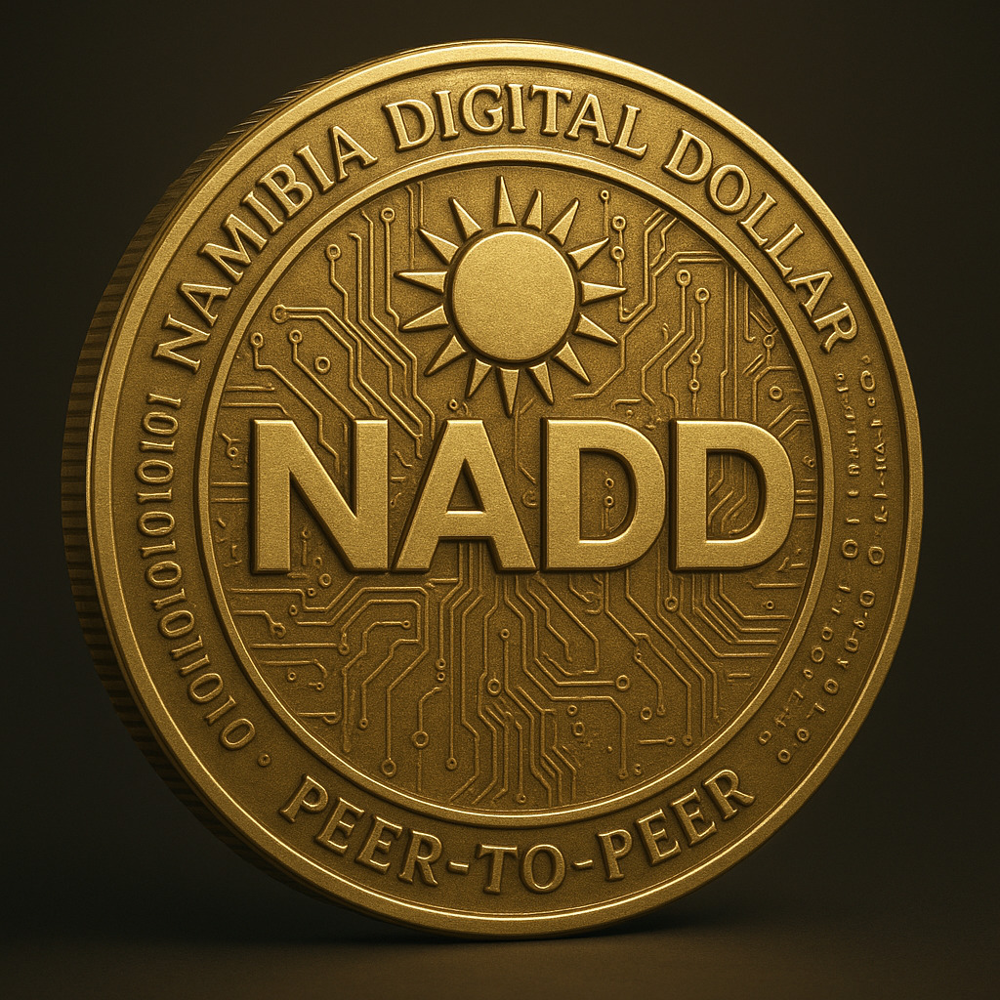

# 🇳🇦 Namibia Digital Dollar (NADD)

[](LICENSE)   [](SECURITY.md)


## NADD Token Draft



# 🚀 Press Release: NADD Mainnet Deployment

The **Namibia Digital Dollar (NADD)** — Namibia’s first blockchain-native stablecoin — has been **successfully deployed and verified on the Binance Smart Chain (BSC) Mainnet**.  

NADD represents a groundbreaking step in Namibia’s digital finance journey, offering a secure, transparent, and programmable digital currency aligned with the NADD Governance Charter.  

📢 **Read the full official press release:**  
➡️ [branding/PRESS_RELEASE_NADD_MAINNET.md](branding/PRESS_RELEASE_NADD_MAINNET.md)

---

## 📘 Namibia Digital Dollar (NADD) — Mainnet Deployment  

The **Namibia Digital Dollar (NADD)** is deployed and verified on **Binance Smart Chain Mainnet** as a fully upgradeable ERC20 stablecoin with governance and timelock control.  

This deployment represents the production-ready version of NADD, designed to serve as a regulated digital currency pegged to the Namibian Dollar. It incorporates advanced features including upgradeability, role-based access control, pausing mechanisms, and timelock governance to ensure security and flexibility.  

**BSC Mainnet Verified Contract Address:**  
`0x0a8f5C56049166b535E698a222d7387b48b7A29E`

You can interact with NADD using BEP-20 compatible wallets such as MetaMask, Trust Wallet, and others that support Binance Smart Chain tokens.  

> ⚠️ **Note:** NADD on Mainnet is live and verified.  
> This contract is ready for real-world transactions and governance operations. Use responsibly.

----------

## 🪙 Add NADD to Your Wallet

You can now easily add the **Namibia Digital Dollar (NADD)** to your BEP-20 compatible wallet and start using it for digital payments, transfers, and merchant transactions.

Follow the full step-by-step guide here:  
👉 [How to Add NADD to Your Wallet](./NADD_ADD_WALLET.md)

Join the movement toward a blockchain-powered Namibian digital economy today!

----------

## 📄 NADD CEX Listing Strategy

A dedicated document outlining the strategic rationale for listing the **Namibia Digital Dollar (NADD)** on centralized exchanges (CEX).  
It covers the purpose, benefits, liquidity pairing strategy (e.g., NADD/USDT), funding targets, and tier-based exchange requirements to drive adoption, accessibility, and market presence.

🔗 [Read more: NADD_CEX_LISTING.md](./NADD_CEX_LISTING.md)

----------

## Executive Summary

The **Namibia Digital Dollar (NADD)** is a blockchain-native, 1:1 Namibian Dollar-pegged stablecoin designed to modernize national payments, enable secure real-time transactions, and accelerate financial inclusion. NADD combines regulatory-compliant smart contracts, role-based governance, EIP-712 off-chain authorization, and reserve attestation to provide a transparent, auditable digital currency backed by fiat reserves.

This repository contains the project’s technical artifacts, deployment scripts, whitepaper, economic analysis, and testing scaffolding for sandbox and testnet operations.

----------

## Overview

NADD is built for safety, compliance, and programmability. It integrates with all BEP-20 compatible wallets including the **Abba App** to deliver mobile-first payments, merchant acceptance, and remittances. NADD is intended to be tested in the **Bank of Namibia Sandbox** before any mainnet deployment. The smart contracts are developed using OpenZeppelin patterns and follow strict role-based controls to limit privileged operations (mint, burn, pause).

📖 Read the full WHITEPAPER here: [WHITEPAPER.md](./WHITEPAPER.md)

----------

## NADD Valuation Summary

This document provides a detailed valuation analysis for the **Namibia Digital Dollar (NADD)**. It covers Namibia’s current money supply (M1 and M2), potential adoption scenarios, hybrid reserve backing, and economic implications across key sectors like mining, fishing, and tourism. It also outlines NADD’s role in enhancing financial inclusion, cross-border liquidity, and global market access, as well as long-term monetization pathways and valuation multipliers. The analysis serves as a reference for **investors, partners, and strategic planning**.

For full details, see [NADD_VALUATION.md](./NADD_VALUATION.md)

----------

### 🇳🇦 NADD Policy Brief: Role in Namibia’s Oil & Gas Industry

The **Namibia Digital Dollar (NADD)** — the nation’s first blockchain-native stablecoin — is pegged 1:1 to the Namibian Dollar and backed by **hybrid on-ledger and fiat reserves**.  
In light of Namibia’s emerging **oil and gas discoveries**, this policy brief explores how NADD can facilitate **efficient, transparent, and compliant financial infrastructure** to support the sector’s growth.  
It outlines how the integration of NADD into the petroleum value chain can **enhance payment efficiency**, **strengthen local currency stability**, and **foster regulatory innovation** in the digital economy.

📄 **Read the full policy brief:** [NADD_OIL_AND_GAS_POLICY_BRIEF.md](./NADD_OIL_AND_GAS_POLICY_BRIEF.md)

----------

## 🛰️ NADD Integration into Namibia’s Financial Infrastructure

NADD is designed for full interoperability across Namibia’s financial and telecom ecosystems — from traditional banks and mobile money platforms (like MTC) to electricity vending and digital service providers.

This integration framework enables **secure, instant, and inclusive digital payments**, even for users without smartphones, through **USSD and custodial wallet support**. It establishes how NADD can work seamlessly with Namibia’s existing payment rails to expand financial inclusion and modernize the national payments system.

📄 Read the full technical paper: [Integrating NADD into Namibia’s National Payment Infrastructure](https://github.com/abba-platforms/NADD/blob/main/technical/NADD_INTEGRATION_INFRASTRUCTURE.md)

----------

## NADD Reserve Model

The Namibia Digital Dollar (NADD) employs a **hybrid reserve model** combining **on-ledger reserves** and **fiat reserves** to ensure full backing of the stablecoin and maintain its 1:1 peg with the Namibian Dollar (NAD).  

NADD is engineered for secure, transparent, and compliant digital currency operations, with a framework that supports custodian banking, proof-of-reserves verification, and integration with local and regional banking infrastructure.  

For full details, methodology, and operational guidelines, see the complete document: [NADD Reserve Model](NADD_RESERVE_MODEL.md)

----------

## 🏢 Company Overview

**NADD Labs (Pty) Ltd** was established in October 2025 by **Simon Kapenda**, the Creator of the **Namibia Digital Dollar (NADD)**, as an independent company spun off from **Abba Payments (Namibia) (Pty) Ltd** — registered under the laws of the Republic of Namibia (Company Registration No. 2023/0770).

NADD Labs (Pty) Ltd serves as the official development, governance, and commercialization entity for the Namibia Digital Dollar (NADD), a blockchain-native stablecoin pegged 1:1 with the Namibian Dollar (NAD).  

📘 [Read the full company profile](./COMPANY.md)

----------

## NADD Executive Management Structure

Namibia Digital Dollar (NADD) operates as an independent division of Abba Payments Namibia (Pty) Ltd., with its own executive management and governance framework. This ensures operational autonomy, transparency, and accountability in the issuance, management, and growth of NADD.

The Executive Management Structure outlines key leadership roles, including:

- CEO, NADD
- CFO, CTO, CCRO, COO
- Head of Policy & Public Affairs
- Communications & Media Director
- Board Liaison / Executive Secretary
- Head of Exchange Operations & Trading (CEX listing & trading)

For complete details, see the full document: [NADD Executive Management Structure](./NADD_EXECUTIVE_MANAGEMENT_STRUCTURE.md)

----------

## 🏛 Governance Charter

The **NADD Governance Charter** establishes the framework for the issuance, operation, compliance, and reserve management of the Namibia Digital Dollar ($NADD).  
It sets out principles of transparency, accountability, peg stability, and alignment with Bank of Namibia standards.

📖 Read the full Charter here: [NADD_GOVERNANCE_CHARTER.md](./NADD_GOVERNANCE_CHARTER.md)

---

### 📌 Key Elements of the Charter

| **Category**             | **Highlights**                                                                 |
|---------------------------|-------------------------------------------------------------------------------|
| **Governance Oversight** | NADD Governance Council ensures transparency, accountability, and compliance. |
| **Reserve Management**   | 1:1 reserves in custodian accounts with Bank of Namibia–licensed banks.       |
| **Peg Stability**        | Real-time peg tracking, with deviations >0.5% disclosed publicly.              |
| **Compliance**           | AML/KYC adherence, quarterly reports, open-source contracts.                   |
| **Risk Management**      | Risk Committee oversight, incident response protocols, public archive.        |
| **Dispute Resolution**   | Internal resolution → mediation → binding arbitration under Namibian law.     |
| **Transparency**         | Monthly supply/reserve reports, quarterly audits, annual compliance reports.  |
| **Ethical Principles**   | Fairness, inclusivity, financial integrity, financial inclusion.              |

----------

## NADD Trust Framework

For a **comprehensive reference** covering NADD’s security, compliance, governance, reserves, economic integration, and lessons from successful private stablecoins, see the **NADD Trust Framework (v1.0)**:

**[NADD_TRUST_FRAMEWORK](./NADD_TRUST_FRAMEWORK.md)**

> This document is intended for internal review, regulatory transparency, and technical reference for developers, auditors, and partners.

It includes:

-   Expanded monetary context (Namibia’s M2, currency circulation, GDP, population)
-   Case studies from USDT, USDC, and other private stablecoins
-   Key Features and Technology Stack for security and compliance
-   Regulatory alignment with Bank of Namibia DPI, AML, and FATF standards
-   Proof-of-Reserves, attestation, and custodian redundancy
-   Governance, operational controls, and user protection measures
-   Economic integration and cross-border trade use cases

----------

## Key Features

-   **1:1 Peg** — Each NADD is intended to be fully backed by NAD reserves.
-   **Role-Based Governance** — DEFAULT_ADMIN, MINTER, BURNER, PAUSER, AUDITOR, CUSTODIAN.
-   **EIP-712 Authorization** — Off-chain deposit certificates signed by custodians to allow gas-efficient minting.
-   **Pausable** — Emergency pause/unpause for safety.
-   **Reserve Attestation Oracle** — On-chain record of attestation reports and reported reserves.
-   **Auditability** — All mint/burn events and attestation records are on-chain for public inspection.
-   **Abba App Integration** — Seamless UX for end-users and merchants.
-   **Sandbox-first** — Designed to operate under Bank of Namibia sandbox rules before any production deployment.

----------

## Technology Stack

-   **Smart Contracts:** Solidity (0.8.x), OpenZeppelin contracts (AccessControl, Pausable, ERC20, EIP-712).
-   **Dev & Test:** Hardhat, ethers.js, mocha/chai tests.
-   **Network Target:** BNB Smart Chain (BSC) Testnet initially; mainnet only after audits and sandbox approval.
-   **Oracles & Attestation:** Simple ReserveAttestationOracle for publishing attestations; off-chain auditors/custodians provide signed reports.
-   **Frontend / Mobile:** Abba App (Android/iOS) for wallet operations and KYC flows.
-   **Storage & Docs:** GitHub repo for source + public docs.

----------

## Token Economics

-   **Peg:** 1 NADD = 1 NAD (aimed).
-   **Minting:** Tokens are minted only when a verified fiat deposit certificate (signed by an authorized custodian) is presented to the contract and executed by a MINTER (multisig recommended).
-   **Burning:** Tokens are burned on redemption requests when custodial processes confirm fiat withdrawal.
-   **Reserve Management:** Custodial bank accounts hold reserves; ReserveAttestationOracle publishes attestations and links to audit reports.
-   **Supply Controls:** No automatic inflation — minting is strictly permissioned and tied to on-chain proofs of off-chain reserves.
-   **Use Cases:** P2P payments, merchant settlement, payroll, remittances, programmable disbursements (social support), and tokenized financial services.

----------

## Security & Compliance

-   **Design Principles:** Minimize attack surface, keep on-chain logic minimal and auditable, keep complex workflows off-chain where appropriate (but always provable).
-   **Libraries:** OpenZeppelin audited libraries used for ERC-20, AccessControl, Pausable, EIP-712 utilities.
-   **Roles & Operational Security:** MINTER/BURNER/CUSTODIAN keys should be held by different multisigs (e.g., Gnosis Safe) and covered by internal processes.
-   **Audits:** Multiple independent audits (internal, external) recommended before any production deployment.
-   **KYC/AML:** Integrated via Abba App; regulatory reporting and compliance logic designed for sandbox review.
-   **Upgradeability:** If upgradeability is required, use a timelock and multisig governance rather than single-key ownership. Prefer minimal upgradable surface and clear governance.

----------

## Roadmap

**Phase 0 – Research & Design**

-   Architecture design, regulatory outreach, partner onboarding (custodians, banks).

**Phase 1 – Dev & Test**

-   Smart contracts implemented; unit & integration tests; testnet deployment (BSC testnet).

**Phase 2 – Sandbox Integration**

-   Onboarding with Bank of Namibia sandbox; integration of custodial flows, KYC, & attestation processes; controlled pilot.

**Phase 3 – Audit & Security**

-   Third-party audits (OpenZeppelin-style recommended), bug bounties, formal verification of critical flows.

**Phase 4 – Production Readiness**

-   Finalize multisig governance, timelock, legal frameworks, insurance & custodial agreements.

**Phase 5 – Mainnet & Scale**

-   Mainnet deployment (post-sandbox & legal sign-off), merchant integrations, cross-border pilots, financial product expansion.

----------

## Risks & Mitigation

-   **Smart contract vulnerabilities** — mitigation: audits, minimal on-chain logic, tests, Slither/Static analysis.
-   **Custody & reserve risk** — mitigation: audited custodians, frequent attestations, public attestation history.
-   **Regulatory risk** — mitigation: sandbox engagement, legal counsel, KYC/AML integration.
-   **Operational compromise** — mitigation: multisig for all privileged roles, separation of duties, monitoring and alerts.
-   **User risk (key loss)** — mitigation: user education, optional custodial services, recovery flows for institutional accounts.

----------

## Governance & Operational Controls

-   Roles are assigned on deployment and must be controlled by secure governance (multi-sig, institutional custody).
-   Admin powers should be restricted; prefer time-locked governance proposals and multi-sig signoffs for major changes.
-   All attestations and mint/burn events are viewable on-chain for auditability.

### 🏛 Governance Charter

The **NADD Governance Charter** establishes the framework for the issuance, operation, compliance, and reserve management of the Namibia Digital Dollar ($NADD).  
It sets out principles of transparency, accountability, peg stability, and alignment with Bank of Namibia standards.

📖 Read the full Charter here: [NADD_GOVERNANCE_CHARTER.md](./NADD_GOVERNANCE_CHARTER.md)

---

### 📌 Key Elements of the Charter

| **Category**             | **Highlights**                                                                 |
|---------------------------|-------------------------------------------------------------------------------|
| **Governance Oversight** | NADD Governance Council ensures transparency, accountability, and compliance. |
| **Reserve Management**   | 1:1 reserves in custodian accounts with Bank of Namibia–licensed banks.       |
| **Peg Stability**        | Real-time peg tracking, with deviations >0.5% disclosed publicly.              |
| **Compliance**           | AML/KYC adherence, quarterly reports, open-source contracts.                   |
| **Risk Management**      | Risk Committee oversight, incident response protocols, public archive.        |
| **Dispute Resolution**   | Internal resolution → mediation → binding arbitration under Namibian law.     |
| **Transparency**         | Monthly supply/reserve reports, quarterly audits, annual compliance reports.  |
| **Ethical Principles**   | Fairness, inclusivity, financial integrity, financial inclusion.              |

---

### 🔐 Controls

- Roles are assigned on deployment and must be controlled by secure governance (**multi-sig, institutional custody**).  
- Admin powers should be restricted; prefer **time-locked governance proposals** and **multi-sig signoffs** for major changes.  
- All **attestations** and **mint/burn events** are viewable on-chain for **full auditability**.  

---

### ⚙️ Operational

- Day-to-day **technical operations** (hosting, contract upgrades, security monitoring) are delegated to an **Operational Partner** regulated by the **Bank of Namibia**.  
- The Operational Partner manages infrastructure uptime, implements **security best practices**, and ensures compliance with the Governance Charter.  
- A formal **Operational Partner Agreement** defines responsibilities, service-level commitments, and audit rights.  

----------

### Contribution Policy (Important)

NADD is a **regulated stablecoin project** with financial, legal, and operational implications. Therefore:

-   **Public contributions are not accepted** at this time.
-   The repository is published for **transparency and review only**.
-   All changes, audits, and deployments are controlled by the project core team and authorized partners.
-   If external researchers discover vulnerabilities, please follow the `SECURITY.md` disclosure process (see the `SECURITY` section below).

----------

## SECURITY / Responsible Disclosure

If you discover a security issue:

1.  Do not publish details publicly.
2.  Contact the project via the disclosed security channel (create an issue labeled `security` or email the security contact listed in repo).
3.  Provide a clear, reproducible test case.
4.  The team will acknowledge within 48 hours and work to remediate.

----------

## 📂 Repository Structure

-   `contracts/` — Solidity smart contracts  
    -   [`NADD.sol`](./contracts/NADD.sol) — ERC-20 + EIP-712 deposit certificate verification + role-based control  

-   `scripts/` — deployment & utility scripts (Hardhat)  
    -   [`deploy.cjs`](./scripts/deploy.cjs) — deploy contracts, set initial roles  
    -   [`sign-and-build-calldata.ts`](./scripts/sign-and-build-calldata.ts) — helper for producing deposit certs  

-   `test/` — unit & integration tests (mocha/chai)  

-   `docs/` — formal docs, diagrams, and regulatory artifacts 

-   [`WHITEPAPER.md`](./WHITEPAPER.md) — full whitepaper  

-   [`NADD_GOVERNANCE_CHARTER.md`](./NADD_GOVERNANCE_CHARTER.md) — governance & regulatory alignment charter  

-   [`NADD_TRUST_FRAMEWORK.md`](./NADD_TRUST_FRAMEWORK.md) — security and compliance framework  

-   [`ECONOMY_OF_NADD.md`](./ECONOMY_OF_NADD.md) — economic analysis and market study  

-   [`.env.example`](./.env.example) — environment template (do not commit private keys)  

-   [`hardhat.config.cjs`](./hardhat.config.cjs) — Hardhat configuration  

-   [`LICENSE`](./LICENSE) — MIT license text and copyright  

-   [`SECURITY.md`](./SECURITY.md) — responsible disclosure instructions (recommended)  

-   [`.github/workflows/`](./.github/workflows) — CI/CD automation (compile/test checks)  

---

> **Note:** Keep `artifacts/`, `cache/`, and `node_modules/` in `.gitignore`.

----------

## Getting Started (Developer)

### Prerequisites

-   Node.js (LTS recommended)
-   npm or yarn
-   Git client
-   MetaMask or wallet with testnet funds for deployment

### Installation

Clone and install:

```bash
git clone https://github.com/abba-platforms/NADD.git
cd NADD
npm install

```

Create `.env` from `.env.example` and fill in values (don’t commit `.env`):

```
PRIVATE_KEY=0xYOUR_PRIVATE_KEY
BSCTEST=https://data-seed-prebsc-1-s1.binance.org:8545/
NADD_ADDRESS=0xYourNADDAddress
BENEFICIARY=0xBeneficiaryAddress
AMOUNT=1
DEPOSIT_REF=BANKDEP-TEST-001

```

### Compile Contracts

```bash
npx hardhat compile

```

### Run Tests

```bash
npx hardhat test

```

Note: tests assume sample keys and local/testnet environment. Review tests and modify accounts/roles as needed.

----------

## Deploy (Testnet)

Deploy to BSC Testnet:

```bash
npx hardhat run scripts/deploy.ts --network bsctest

```

The deploy script will:

-   Deploy `NADDtoken` and `ReserveAttestationOracle`
-   Set initial admin roles (for testnet deployer)
-   Optionally grant CUSTODIAN_ROLE to a test key (not for production)

After deploy, copy the deployed contract addresses into `.env` (or the repo README) for reference.

----------

## How Minting Works (High-Level)

1.  Off-chain: Custodian receives fiat deposit and generates a `DepositCertificate` JSON including beneficiary, amount, currency, depositRef, timestamp, and nonce.
2.  Custodian signs the typed-data (`EIP-712`) using its custody key.
3.  Minter (on-chain actor, likely multisig) submits the certificate and the custodian signature to `mintWithCert()` in the `NADDtoken.sol` contract.
4.  Contract verifies signature against `CUSTODIAN_ROLE`, checks for replay (fiatRefHash), mints tokens to beneficiary, and marks certificate used.
5.  Attestation Oracle receives periodic reserve audit reports signed by auditors and publishes them for transparency.

----------

## Reserve Attestation & Oracle

`ReserveAttestationOracle` holds attestations with:

-   timestamp
-   submittedBy (attestor)
-   reportHash (hash of the off-chain audit report)
-   totalReserves (numeric)
-   uri (link to the attestation / report)

Design notes:

-   Oracles are simple on-chain records; heavy report content stays off-chain (IPFS/HTTPS).
-   Attestations are time-stamped to provide an audit trail and public verification.

----------

## Economic & Market Insights (Summary)

See `ECONOMY_OF_NADD.md` for the full analysis. In short:

-   NADD aims to reduce cash handling costs, speed settlement, and increase financial inclusion.
-   It supports remittances, merchant payments, and programmable disbursements (social programs/payments).
-   Reserve transparency (attestations & audits) is key to maintaining confidence in the peg.

----------

## Examples & Developer Tools

-   `scripts/sign-and-build-calldata.ts` — example script to produce an EIP-712 signature for deposit certificates and print ABI-encoded calldata for `mintWithCert`.
-   `test/` contains unit tests demonstrating minting flow (EIP-712 signing via ethers `_signTypedData` in tests), burn flows, pause/unpause, and oracle attestations.

----------

## CI / Quality Gate (Recommended)

-   Use GitHub Actions to:
    -   run `npx hardhat compile`
    -   run `npx hardhat test`
    -   run static analysis (Slither / MythX for deeper checks) on pull requests
-   Require passing checks for any change to contracts or critical scripts.

----------

## License

© 2025 Abba Payments Ltd.  
Simon Kapenda, Creator and Developer

This project is licensed under the **MIT License**. See the `LICENSE` file for full text.

----------

## Regulatory Disclaimer

NADD is a regulated-stablecoin initiative. Nothing in this repository constitutes financial, investment, or legal advice. Use of NADD or any code herein is subject to regulatory approval and local law. This repository is published for transparency and technical review only. Do not rely on this repo for operational funds or production-critical deployments without appropriate legal, regulatory, and technical approvals.

----------

## References

-   EIP-20: ERC-20 Token Standard — [https://eips.ethereum.org/EIPS/eip-20](https://eips.ethereum.org/EIPS/eip-20)
-   EIP-712: Typed Structured Data — [https://eips.ethereum.org/EIPS/eip-712](https://eips.ethereum.org/EIPS/eip-712)
-   OpenZeppelin Contracts — [https://openzeppelin.com/contracts/](https://openzeppelin.com/contracts/)
-   Abba App — [https://www.abbapp.com](https://www.abbapp.com)
-   CillarCoin — [https://cillar.io](https://cillar.io)
-   AFRX — [https://afrx.io](https://afrx.io)

----------

## Author & Creator

**Simon Kapenda**  
Founder & Creator — Abba Payments Ltd., Oshakati, Namibia  
Creator & Developer of: CillarCoin ($CILLAR), AFRX Security Token ($AFRX), $ENGLISH MEMECOIN, Abba App, Angola Digital Kwanza (AOAk), and Zimbabwe Digital Dollar (ZDD).  
LinkedIn: [https://linkedin.com/in/simonkapenda](https://linkedin.com/in/simonkapenda)

----------
